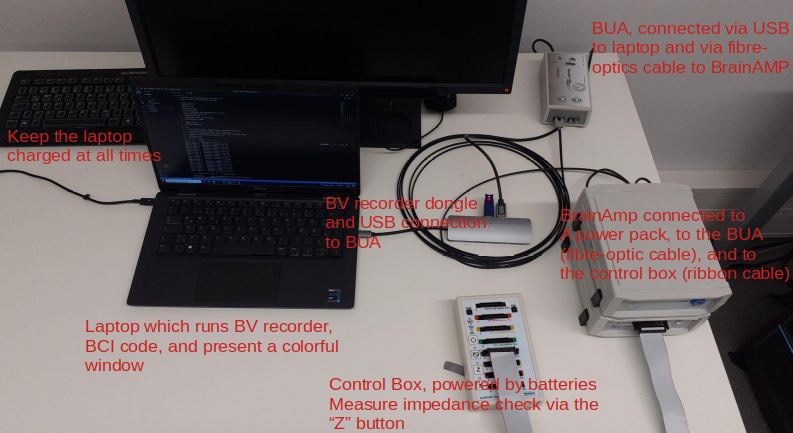

# lndw2022

- lndw = "Lange Nacht der Wissenschaften" (German for "Long Night of the Sciences")
- see: https://www.langenachtderwissenschaften.de/en/

This repository contains code for the LNdW 2022 at the Max Planck Institute for Human Development (MPIB)
for the Adaptive Memory and Decision Making group (AMD).
In 2022, the LNdW will happen on the 2nd of July (17:00 - 24:00).

The repository is hosted on GitHub: https://github.com/sappelhoff/lndw2022

It is mirrored on the ARC GitLab (internal only): https://arc-git.mpib-berlin.mpg.de/appelhoff/lndw2022

# General overview

The general plan for this presentation is by Bernhard Spitzer.

## Demonstration

We will show visitors a brain computer interface (BCI) and have a discussion about "mind reading".

- A participant from the AMD lab will wear an EEG cap and we record data live and show it on the screen
- Furthermore, a screen window (via PsychoPy) will shown red or blue color
  (or a continuous gradient between those colors)
- The participant is then instructed to either:
    - (i) think of something cold (the arctic, a cool drink, ...)
    - (ii) think of something hot (the desert, ...)
- What the participant really does however, is to influence their EEG in such a way that
  average alpha power (frequencies 8-12 Hz) is higher either in posterior channels,
  or in frontal channels (for methods on how to achive that, see below)
- Internally, we continuously compute an index based on the difference between posterior and frontal
  average alpha power and use this index to color the PsychoPy window
- To visitors it will seem as if the BCI "reads the mind" of the participant thinking about something
  hot or cold, whereas in truth -- we are using a simple "trick" to achieve this.
- After a short presentation of this, we debrief the visitors, explain the "trick" and enter into a
  discussion of what **is** possible via BCIs, and what is (currently) not easily possible.

## How to influence EEG frontal and posterior alpha power

- Alpha power is typically very high in posterior channels when the participant is in a relaxed state
  with their eyes closed
- In contrast, alpha power is relatively low in frontal channels
- Alpha power can be artificially brought up in frontal channels by moving the eyes (which are dipoles),
  or rapidly blinking
- During the deomnstration, the participant should try to not make the two states (blinking vs. relaxed)
  too obvious to the audience ... to maintain the impression of the "trick" (until debriefing)

In `main.py`, there is a variable called `SWITCH_TYPE`.
This variable can be used to change between 3 particular methods:

- `SWITCH_TYPE = "continuous"`
    - The default method: We calculate `log10(posterior / frontal)` and use the resulting index
      to continuously color the window more red or more blue (purple is the "middle")
- `SWITCH_TYPE = "sign"`
    - A "binary" method, where the color is either red or blue.
      Here we calculate `sign(posterior - frontal)`.
- `SWITCH_TYPE = "frontal boost"`
    - A variation of the "sign" method, where the window is always blue, unless we find
      `frontal > posterior * factor`, where `factor` can be freely adjusted

Depending on the participant and training, one `SWITCH_TYPE` may work better
than the other one.

In `main.py` pay attention to the variables that are all upper-case.
These variables may be easily modified to adjust the setup for a particular participant
(for example `WIN_SIZE_PIXELS`, `SECONDS_TO_GET`, `SCALE_POSTERIOR`).
Inline comments document what these variables do.

# Required hardware

- A Windows laptop (minimum 2 USB-A slots: one for the BrainVision Recorder dongle, one for connecting to the BrainAmp)
- A BrainAmp + 2x cable (fibreoptics, ribbon)
- A power pack + cable + charger
- A controlbox + USB cable
- 4 batteries + charger
- A set of 32 electrodes
- A set of REF + GND electrodes
- A BUA (BrainVision USB adapter) + USB cable
- A "signal tester" box + cable (ribbon)

And additionally:

- One more laptop and big screen for showing the presentation
- A power strip to plug all the devices

See also the `setup_drawing` directory.

# Software dependencies and installation

First, if you don't have it installed already, download miniconda:
https://docs.conda.io/en/latest/miniconda.html

Then install mamba into your base environment.
From your conda prompt or shell, run: `conda install -c conda-forge mamba --yes`

Then you can use the `environment.yml` file in this repository to install the
remaining dependencies: `mamba env create -f environment.yml`

Running `conda activate lndw2022` will then provide you with an appropriate environment.

The most important dependencies are:

- `pylsl` for getting the live EEG data
- `mne` for processing the EEG data
- `psychopy` for showing a window and switching its color

Furthermore, you will need the following software:

- BrainVision Recorder (plus license dongle)
- The BrainVision Recorder Remote Data Access LabStreamingLayer (LSL) client: https://github.com/brain-products/LSL-BrainVisionRDA
- Any presentation software (to show the presentation during the LNdW)

# Running the project

1. In the BrainVision Recorder settings, make sure Remote Data Access (RDA) is **enabled** (see manual)
1. Setup the hardware (see manual) with the laptop
    1. Set the sampling frequency in BrainVision Recorder to 250 Hz
    1. Use the "green" slot for the 32 electrodes
1. Start recording data, run the RDA LSL client and "link" it to stream the data live to the local network
1. From a command line prompt, run `python -u main.py` (after activating the conda environment, see above)
1. You can stop the program by clicking on the colorful PsychoPy window and pressing "escape"
   (or interrupt it by pressing ctrl+c in the command line prompt)

# Testing data

In the `testing_data/` directory you will find data to play around with for optimizing the BCI.
The `offline_test` data contains four markers:

- `open_relax`
- `open_blink`
- `closed_relax`
- `closed_blink`

where the first factor before the `_` refer to the state of the eyes, and the second factor
(after the `_`) refers to the activity.
After each marker, there are at least 8 seconds of data during which the respective activity was
performed by the test session participant.

# Files in this repository

- `README.md` --> the README file you are reading
- `main.py` --> the main script for running the project
- `environment.yml` --> a list of most of the software dependencies
- `LICENSE` --> how the code and documentation in this project are licensed (but not the general idea)
- `.gitignore` --> which files to ignore in the version control via git
- `setup.cfg` --> configuration that is relevant when developing the code
- `testing_data/offline_test*.*` --> a BrainVision file triplet (`.eeg`, `.vhdr`, `.vmrk`) for testing offline
- `testing_data/analyze_testing_data.py` --> script for exploring the testing data
- `setup_drawing/lndw_setup_*` --> three files that show the hardware setup
- `slides/*.pptx` --> the presentation slide show for the evening
- `electrode_cap/AC-32.bvef` --> names and template locations of the 32 channels to be used
- `electrode_cap/CAC-32.pdf` --> visualization of what the expected cap layout is
- `electrode_cap/CAC-64.pdf` --> same as `CAC-32`, but with additional "yellow" channels that can be ignored
